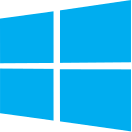

### 1. Установка на Linux

___

Под Linux можно установить GIT с помощью менеджера пакетов. Если, например, у вас дистрибутив Ubuntu, то установку можно запустить из командной строки:  

~~~
$ sudo apt install git
~~~

Если у вас другие дистрибутивы, то с командами установки можно ознакомиться на следующей странице. 

[Установка под различные дистрибутивы Linux и Unix](https://git-scm.com/download/linux)

___

### 2. Установка на Windows

___
Для установки под Windows необходимо перейти по [ссылке](https://www.git-scm.com/download/win) на официальный сайт GIT и скачать нужный инсталляционный файл для вашей системы.  

Если коротко при установке можно оставлять ***"параметр по умолчанию"*** или параметр ***"Recommended"***. 

Если вы планируете использовать текстовый редактор для GIT Visual Studio Code, то можно поменять редактор: ***Choosing the default editor used by GIT*** на параметр ***Use visual studio code as GIT's default editor*** для дальнейшего удобства.  

Также можно ознакомиться со [статьей по установки GIT на Windows](https://selectel.ru/blog/tutorials/how-to-install-git-to-windows/) подробно описывающая установку.
___

Установка на MAC  

___

Один из способов установить на MAC GIT, сначала необходимо установить *Xcode Command Line Tools*. После в терминале ввести команду
```
$ git --vesion
```
Если GIT не установлен, то вам будет предложено его установить. Также можно установить GIT на MAC перейдя по [ссылке](https://www.git-scm.com/download/mac) на официальный сайт GIT и скачать **installer** бинарный установщик.