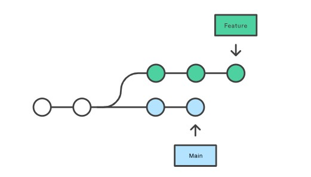
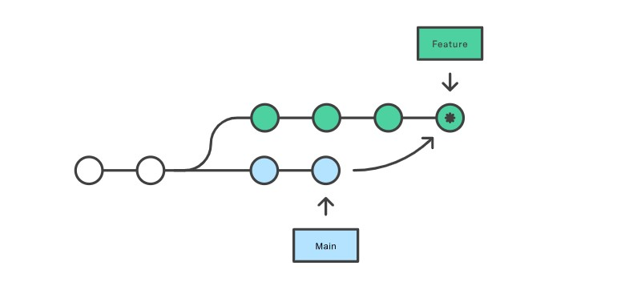
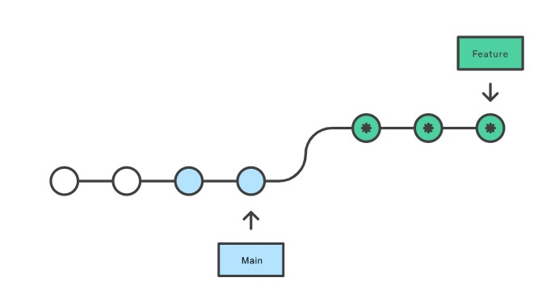

### Отличие слияния merge и rebase
___
Существует две ветки над которыми работают несколько разработчиков. После создания новой ветки в основную ветку были внесены изменения.

  

Для включения новых коммитов в свою функциональную ветку feature можно использовать два варианта: слияние или перебазирование.

### Слияние merge
___
Эта операция создает в ветке feature новый «коммит слияния», связывающий истории обеих веток. Структура веток будет выглядеть так:

Слияние (merge) — это отличная неразрушающая операция. Существующие ветки никак не изменяются. Эта операция позволяет избегать потенциальных проблем.  
С другой стороны, это означает, что каждый раз, когда вам будет необходимо включить вышестоящие изменения, в функциональную ветку feature будет попадать внешний коммит слияния. Если работа в главной ветке main ведется активно, история вашей функциональной ветки быстро засорится.  

### Преобразование rebase

Вместо слияния можно выполнить перебазирование функциональной ветки feature на главную ветку main.

В результате вся функциональная ветка feature окажется поверх главной ветки main, включая в себя все новые коммиты в ветке main. Если вместо команды merge при коммитах используется rebase, эта команда перезаписывает историю проекта, создавая новые коммиты для каждого коммита в исходной ветке.  

Главное преимущество rebase — более чистая история проекта. Во-первых, эта команда устраняет ненужные коммиты слияния, необходимые для git merge. Во-вторых, как показано на рисунке выше, команда rebase создает идеальную линейную историю проекта — вы сможете отследить функционал до самого начала проекта без каких-либо форков.

Однако такая безупречная история коммитов требует определенных жертв: жертвовать приходится безопасностью и отслеживаемостью.

Перезапись истории проекта может обернуться катастрофическими последствиями для совместных рабочих процессов. Кроме того, при выполнении rebase теряется контекст, доступный в коммите со слиянием: вы не сможете увидеть, когда вышестоящие изменения были включены в функционал.
