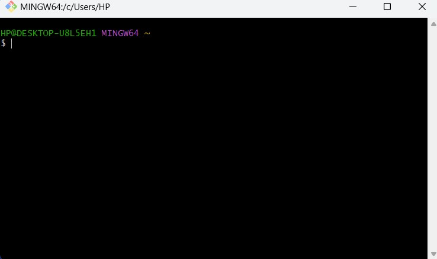
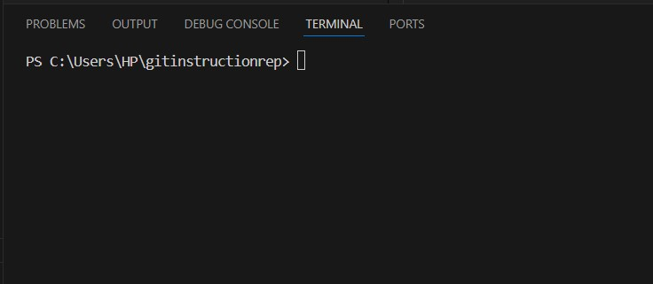

### Терминал для ввода команд в Windows
___
После установки GIT вам доступен терминал для ввода комманд. Чтоб его открыть нужно перейти во все ***"программы"***, найти ***"каталог GIT"*** и запустить ***"GIT Bash"***  

### Терминал для ввода команд Visual Studio Code
___
Также доступен терминал в программе Visual Studio Code. Для того, чтобы открыть терминал необходимо в вверхнем меню выбрать ***"Терминал"*** и выбрать ***"New terminal"***. Внизу появиться командная строка, где можно вводить команды.  

### Терминал для ввода команд Linux
___
В дистрибутивах Linux, чтобы набирать команды GIT необходимо использовать терминал, который уже установлен в Linux.

### Терминал для ввода команд на Mac
___
В среде Mac также для ввода команд надо использовать терминал, который уже установлен в системе.